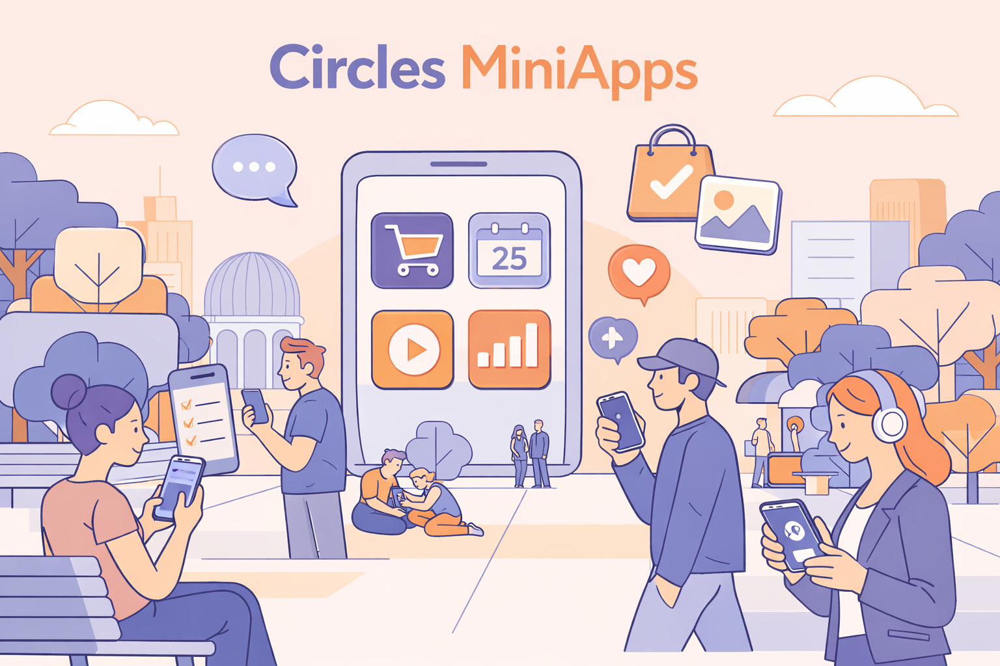

# What are Circles MiniApps?

<figure><figcaption></figcaption></figure>

Circles MiniApps are focused web applications built around Circles.

They are designed to deliver a narrow, task-specific experience rather than a full wallet or a broad product surface.

The core idea is simple: a MiniApp should help a user complete one or a few meaningful actions quickly within a Circles-based product experience. Instead of recreating an entire wallet or ecosystem interface, a MiniApp focuses on doing one thing well, such as making a payment, joining a group, claiming something, or completing a specific workflow.

#### Hosted MiniApps

In the hosted model, the user opens the MiniApp inside the Circles MiniApp environment and signs actions directly there using their Gnosis App passkey.

This creates the smoothest user experience because the user stays within a single flow, without switching devices or scanning QR codes. It feels closer to a native Circles experience and allows tighter integration with the Circles host and SDK.

Hosted MiniApps are typically the right choice when you want stronger integration with the Circles ecosystem, direct wallet interaction inside the app, and better discoverability through store-based distribution.

Advantages

* Smooth, native-feeling user experience for exisiting Gnosis App users
* No extra QR scan step for wallet approval
* Stronger integration with the Circles host and SDK
* Better fit for repeat usage and polished product flows
* Can benefit from MiniApp store discovery and distribution

Disadvantages

* Requires integration with the Circles host environment
* Usually needs more work to support SDK-based wallet flows
* May require store listing or ecosystem-specific distribution
* Less flexibility (especially if you require third party intgration like a db) compared to a fully standalone web app
* More dependent on platform-specific constraints and conventions

Best for

* Native Circles experiences
* Direct in-app wallet interactions
* Consumer-facing apps that benefit from low-friction UX
* Apps intended for ecosystem discovery and repeat use


A few examples of Hosted MiniApps


#### QR-initiated MiniApps

In the QR-based model, the MiniApp runs as a normal web application on a shared screen, kiosk, event booth, merchant checkout page, or standard website. When wallet approval is needed, the page displays a QR code, and the user scans it with Gnosis App to complete the action.

This approach is often easier to deploy because it does not require hosted MiniApp integration or store listing. It also gives builders more freedom to use their own backend, infrastructure, and application setup. The tradeoff is that it introduces an extra approval step, which makes the flow less seamless than a hosted MiniApp.

Advantages

* Easier and faster to deploy
* Works as a normal web app without full host integration
* No need for MiniApp store listing
* Greater flexibility in backend, architecture, and product design
* Well suited for physical-world setups like booths, kiosks, and merchant flows
* Easier to experiment with custom infrastructure or non-standard app logic

Disadvantages

* Less seamless user experience
* Requires the user to scan a QR code for wallet approval
* Adds friction compared to direct in-app signing
* Can feel less native to the Circles ecosystem
* Multi-device interaction may slow down quick transactions

Best for

* CRC transfer-related flows
* Event booth experiences
* Merchant checkout flows
* Apps that need custom backend logic or more deployment freedom


An example of QR-initiated MiniApp

