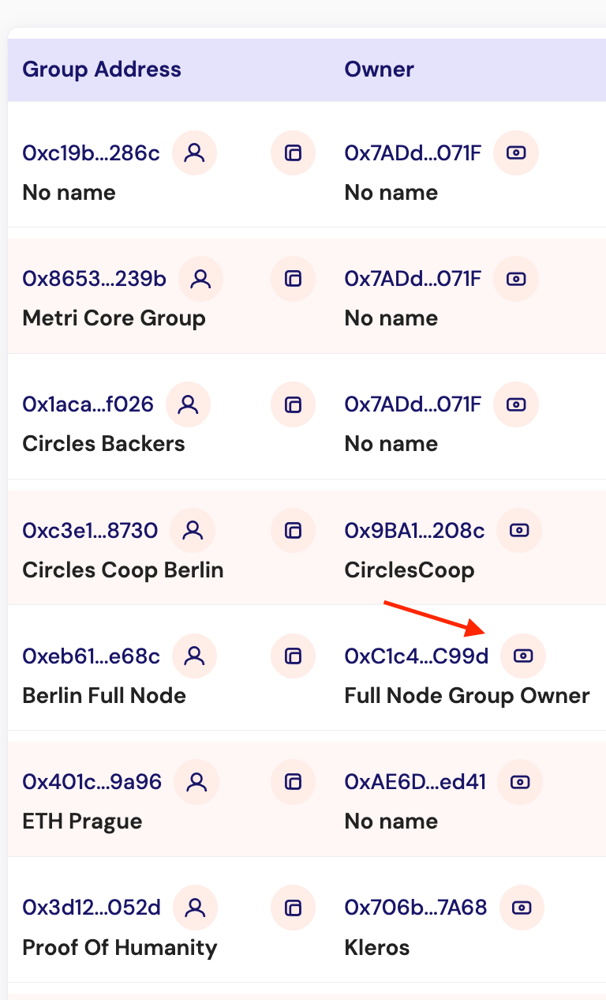
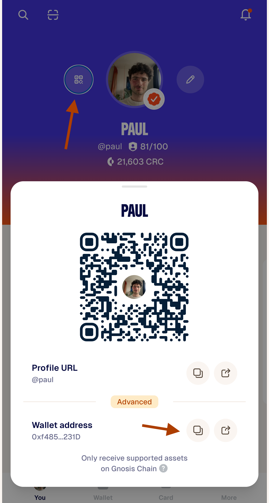

# Migrate your group and update its details

New properties have been added to the group contract, and group admins need to fill them in. This guide walks you through making your Circles profile an admin of the group and then updating the new fields in the admin app.

The process is straightforward: you add your Circles profile as a signer of the group's owner Safe, then use that connection to edit the group in the admin app.

### Assumptions

Before you start, this guide assumes the following:

* You set up your account using [app.aboutcircles.com](https://app.aboutcircles.com). This means you have a signer and a wallet you can connect to that app to modify your account.
* Your group is owned by a Safe (multisig) that you control.
* You have a Circles profile and are willing to use it as an admin of the group.

### Which steps apply to you?

* If you created your group using [app.aboutcircles.com](https://app.aboutcircles.com), start at **Step 1**.
* If you created your group using [circles.gnosis.io/admin/circles-groups](https://circles.gnosis.io/admin/circles-groups), skip to **Step 6**.

## Part 1 — Make your Circles profile an admin of the group

### Step 1: Find your group

Open the Group Checker and locate your group:



### Step 2: Open the owner Safe

In the **Owner** column, find the owner Safe of your group and click the wallet symbol next to it to open it in the Safe UI.

<figure><figcaption>
The Owner column in the Group Checker. Click the wallet symbol to open the owner Safe.
</figcaption></figure>

### Step 3: Connect to the Safe UI

Connect to the Safe UI using your owner EOA — the wallet that owns the Safe.

### Step 4: Find your Circles profile address

Locate the address of your personal Circles profile (for example, via the Gnosis App).

<figure><figcaption>
In the Gnosis App, open the QR code panel and copy your wallet address from the Advanced section.
</figcaption></figure>

### Step 5: Add your Circles address as a signer

In the Safe UI, go to **Settings → Manage Signers** and add your Circles address as a signer. Then sign the transaction.


Once the transaction is confirmed, your Circles profile is an authorised admin of the group's owner Safe and you can use it to edit the group.


## Part 2 — Update the group details

### Step 6: Sign in to the admin app

Go to [circles.gnosis.io/admin/circles-groups](https://circles.gnosis.io/admin/circles-groups) and sign in using your passkey for the Gnosis App.

### Step 7: Open your group

Open your group and select **Edit Details**.

### Step 8: Edit the details

Fill in the new fields:

* **Description** — Explain the purpose of the group and the benefits of joining.
* **Group type** — Set this to **closed**.
* **Contact details** — Provide a way for prospective members to reach you.
* **Membership Fee** and **Minimum Rep Score** — Optional.
* **Additional Criteria** — A brief description of how a user can join the group.

### Step 9: Save

Click **Save** to apply your changes.


That's it — your group details are now updated.

