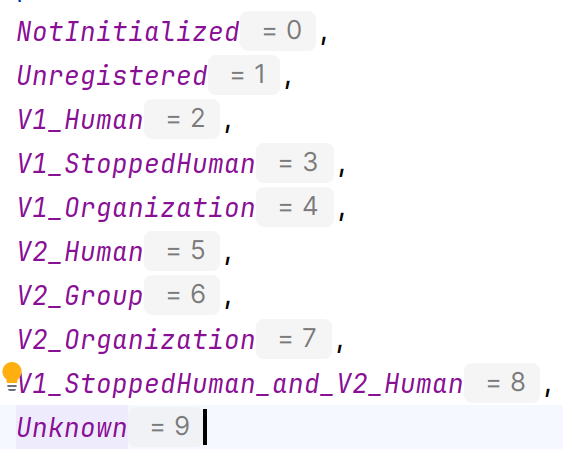

# 🎴 Creating an Avatar

&#x20;To interact with Circles SDK, you would need an avatar. You can create one by calling `createAvatar`. The address for this avatar can be an EOA address or a smart account address. You should be fully in control of your account. You can derive the address from the signer and pass it in `sdk.createAvatar.`

```javascript
const avatar = await sdk.createAvatar("0x123"); 
await avatar.initialize();
```

### Subscribing to the state of Avatar

Subscribing to the state of Avatar allows developers to track changes in the state of an avatar object. By subscribing to the avatar's state observable or event emitter, developers can execute custom logic whenever the state of the avatar changes.

```javascript
avatar.state.subscribe((state) => {
 avatarState = state;
});
```

### Understanding different states of Avatar

Now, based on your Avatar generation and activity, you can understand its various states.&#x20;

<div align="center">

<figure><figcaption><p>Mapping for states of Avatar</p></figcaption></figure>

</div>


```solidity
enum AvatarState {
 Unregistered,                 // address has not been used with Circles before
  V1_Human,                    // address is only a V1 human
  V1_StoppedHuman,             // address is only a V1 human that has been stopped
  V1_Organization,             // address is only a V1 organization
  V2_Human,                    // address is only a V2 human
  V2_Group,                    // address is only a V2 group
  V2_Organization,             // address is only a V2 organizations
  V1_StoppedHuman_and_V2_Human,// address is a V1 human that has been stopped and a V2 human
  Unknown                      //address has been used with Circles before, but the state is unknown
}
```


For instance, as you convert your circles account from V1 human to V2 human, your state will change to `8`which is `V1_StoppedHuman_and_V2_Human.` This way you shall be able to track your circles avatar account and actions.
