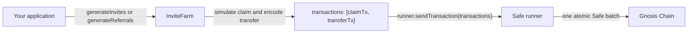

# Invitations and

Use the Circles SDK to spend invite quota that an inviter already holds and register new humans on Circles.

This guide covers two onboarding flows:

* **Existing-wallet users:** invite people who already have a Safe wallet.
* **New users:** create referral links for people who do not have a wallet yet.

The SDK prepares the required transaction batch. A runner executes that batch atomically through the inviter's Safe. You do not need to call the underlying contracts directly.

> **Scope** This guide assumes that the inviter already has invite quota. For getting quota for your community, please reach out to our team on [Telegram](https://t.me/about_circles/499).

### Overview

The SDK exposes two levels of abstraction:

| API                                               | Use it when                                                                                             | Method                                                                      | Execution behavior                                                |
| ------------------------------------------------- | ------------------------------------------------------------------------------------------------------- | --------------------------------------------------------------------------- | ----------------------------------------------------------------- |
| `InviteFarm` from `@aboutcircles/sdk-invitations` | You manage transaction execution yourself, use a server relayer, or need to inspect or extend the batch | `generateInvites(inviter, invitees)` or `generateReferrals(inviter, count)` | Returns unsigned transactions. You pass them to a runner.         |
| `HumanAvatar.invitation` from the top-level SDK   | You already have a runner-backed `HumanAvatar` and want a build-and-send flow                           | `avatar.invitation.generateReferrals(count)`                                | Builds and executes the transactions through the avatar's runner. |



### Prerequisites

Before using `InviteFarm`, make sure that:

1. The inviter already has enough quota for the number of invites.
2. Your configuration includes `referralsServiceUrl`.
3. The inviter's Safe has completed the one-time invitation setup.
4. You have a runner capable of executing the returned transaction array as one atomic Safe batch.

#### One-time inviter setup

Before the inviter sends their first invitation, their Safe must have the `InvitationModule` enabled and the required module-organization trust configured.

Use `Invitations.ensureInviterSetup(inviter)` to generate any missing setup transactions, then execute those transactions once.

### Initialize `InviteFarm`

Create an `InviteFarm` instance from a `CirclesConfig`. The config must include `referralsServiceUrl`, even when you only use farm methods, because `InviteFarm` internally creates an `Invitations` instance.

```ts
import { InviteFarm } from '@aboutcircles/sdk-invitations';
import { circlesConfig } from '@aboutcircles/sdk-utils';

const config = {
  ...circlesConfig[100], // Gnosis Chain defaults: addresses and RPC configuration
  referralsServiceUrl: 'https://example.com/referrals',
};

const farm = new InviteFarm(config);
```

### Check available quota

Each quota unit represents one invitation funded with `96 CRC`.

```ts
const quota = await farm.getQuota(inviterAddress);

if (quota < 1n) {
  throw new Error('No invite quota available');
}
```

Useful helpers:

```ts
const invitationFee = await farm.getInvitationFee(); // 96 CRC as bigint
const invitationModule = await farm.getInvitationModule(); // module address
```

For batch invitations, validate that the inviter has enough quota for the full batch:

```ts
const count = invitees.length;
const quota = await farm.getQuota(inviterAddress);

if (quota < BigInt(count)) {
  throw new Error('Insufficient invite quota');
}
```

> **Note** A quota check is best-effort. The final debit occurs on-chain when `claimInvite()` or `claimInvites(count)` executes. The transaction reverts if the inviter no longer has enough quota.

### Invite users who already have a wallet

Use `generateInvites` for users who already have a Safe wallet but are not yet registered as Circles humans.

The SDK encodes the invitee wallet addresses directly in the transfer data. It does not create accounts for these invitees.

```ts
const { invitees, transactions } = await farm.generateInvites(inviterAddress, [
  '0xAAA...',
  '0xBBB...',
  '0xCCC...',
]);

await runner.sendTransaction(transactions);
```

#### Requirements

* The `invitees` array must not be empty.
* Each invitee must already have a Safe wallet.
* Each invitee's Safe must already have the `InvitationModule` enabled. Use the referral flow for brand-new users instead.

#### Returned transactions

For one invitee, the SDK returns:

```
[claimInvite(), safeTransferFrom(...)]
```

For multiple invitees, the SDK returns:

```
[claimInvites(count), safeBatchTransferFrom(...)]
```

### Create referrals for brand-new users

Use `generateReferrals` for users who do not have a wallet yet.

The SDK creates a temporary keypair for each referral and encodes a `ReferralsModule.createAccount()` or `createAccounts()` call. The on-chain flow pre-deploys a claimable Safe for each new user.

```ts
const { referrals, transactions } = await farm.generateReferrals(inviterAddress, 25);

// Execute the complete batch atomically.
await runner.sendTransaction(transactions);

// Persist each referral secret so it can be included in a referral link or QR code.
for (const { secret } of referrals) {
  await sdk.referrals.store(secret, inviterAddress);
}
```

`generateReferrals` returns one referral object per new user:

```ts
type Referral = {
  secret: Hex;
  signer: Address;
};
```

#### Store referral secrets securely

Each `secret` is the only way to claim its corresponding pre-deployed account. Persist every secret and deliver it to the intended user through a referral link or QR code.

> **Warning** If a referral secret is lost, the pre-deployed account cannot be claimed.

#### How a new user claims a referral

A new user opens a referral link containing the secret and completes the claim flow:

1. Create a device WebAuthn passkey.
2. Sign the module's EIP-712 passkey digest with the referral secret.
3. Relay `ReferralsModule.claimAccount(...)`.
4. Bind the passkey as the Safe signer.
5. Receive the `48 CRC` welcome bonus.
6. Complete registration as a self-custodial Circles human with the original inviter recorded as the permanent inviter.

The claim call has the following shape:

```ts
ReferralsModule.claimAccount(
  x,
  y,
  verifier,
  signature,
  metadataDigest,
  affiliateGroup?,
);
```

### Use the high-level referral API

When you already have a runner-backed `HumanAvatar`, use the high-level API to generate and execute referrals in one call:

```ts
const { secrets, signers, transactionReceipt } =
  await avatar.invitation.generateReferrals(25);

for (const secret of secrets) {
  await sdk.referrals.store(secret, avatar.address);
}
```

The high-level facade also exposes:

```ts
await avatar.invitation.getQuota();
await avatar.invitation.getInvitationFee();
```

For single-invite flows, it also provides:

```ts
await avatar.invitation.getReferralCode();
await avatar.invitation.invite(inviteeAddress);
```

### Execute invitation transactions atomically

Both `generateInvites` and `generateReferrals` return exactly two transactions:

```
[claimTx, transferTx]
```

Always pass the complete array to a runner in a single call:

```ts
await runner.sendTransaction(transactions);
```

Use a runner from `@aboutcircles/sdk-runner`:

* `SafeContractRunner` for server-side execution with a private key.
* `SafeBrowserRunner` for browser-wallet execution.

> **Important** Do not send `claimTx` and `transferTx` separately. During the claim, the funding bot grants the inviter temporary trust that is valid only for the current block. The `InvitationModule` checks that trust when the borrowed CRC arrives. If the transactions are split across blocks, the transfer reverts with `TrustRequired`.

### How `InviteFarm` builds the batch

For every `generateInvites` or `generateReferrals` call, `InviteFarm` performs the following steps:

#### 1. Simulate the claim

The SDK calls `simulateClaim(inviter, count)`, which runs an `eth_call` for `claimInvite()` or `claimInvites(count)` with `from: inviter`.

This simulation determines which farm-bot token IDs will be allocated. The IDs must be known before execution because a Safe batch cannot pass the runtime return value of `claimInvites()` into the next transfer call.

Allocation is deterministic from the current chain state, so the simulated IDs match the real claim unless a competing claim changes the state first.

#### 2. Generate referral secrets when needed

For referral flows, the SDK generates one `{ secret, signer }` pair per new user.

#### 3. Build the two transactions

The SDK creates:

```
claimTx = invitationFarm.claimInvite()
       or invitationFarm.claimInvites(count)

transferTx = hubV2.safeTransferFrom(...)
          or hubV2.safeBatchTransferFrom(...)
```

Each transfer sends `96 CRC` per invitation from the inviter to the `InvitationModule`.

The transfer `data` depends on the onboarding flow:

| Flow                 | Encoded transfer data                                                                             |
| -------------------- | ------------------------------------------------------------------------------------------------- |
| Existing-wallet user | `encodeAbiParameters(['address'], [invitee])` or `encodeAbiParameters(['address[]'], [invitees])` |
| New-user referral    | `encodeAbiParameters(['address', 'bytes'], [referralsModule, createAccount(s)(signers).data])`    |

#### 4. Return the batch

The SDK returns:

```ts
{
  // flow-specific values
  transactions: [claimTx, transferTx],
}
```

#### On-chain result

For each successful invitation:

* The inviter's quota decreases by one.
* The farm bot's `96 CRC` funds registration and is returned to the bot.
* The new human is registered with the original inviter recorded as the permanent inviter.

### API reference

#### `InviteFarm`

Package: `@aboutcircles/sdk-invitations`

```ts
new InviteFarm(config: CirclesConfig)
```

`config` must include `referralsServiceUrl`.

```ts
getQuota(inviter: Address): Promise<bigint>

getInvitationFee(): Promise<bigint>

getInvitationModule(): Promise<Address>

listReferrals(
  inviter: Address,
  limit?: number,
  offset?: number,
): Promise<ReferralPreviewList>
```

**`generateInvites`**

```ts
generateInvites(
  inviter: Address,
  invitees: Address[],
): Promise<{
  invitees: Address[];
  transactions: TransactionRequest[];
}>
```

**`generateReferrals`**

```ts
generateReferrals(
  inviter: Address,
  count: number,
): Promise<{
  referrals: {
    secret: Hex;
    signer: Address;
  }[];
  transactions: TransactionRequest[];
}>
```

#### `HumanAvatar.invitation`

High-level, runner-backed facade:

```ts
generateReferrals(count: number): Promise<{
  secrets: Hex[];
  signers: Address[];
  transactionReceipt: unknown;
}>

getQuota(): Promise<bigint>

getInvitationFee(): Promise<bigint>

getReferralCode(): Promise<{
  transactions: TransactionRequest[];
  privateKey: Hex;
}>

invite(invitee: Address): Promise<TransactionRequest[]>
```

#### Runner execution

Package: `@aboutcircles/sdk-runner`

```ts
runner.sendTransaction(
  transactions: TransactionRequest[],
): Promise<TransactionReceipt>
```

Available Safe runners:

```ts
SafeContractRunner
SafeBrowserRunner
```

#### Referral storage

Persist and retrieve referral secrets through the top-level SDK:

```ts
await sdk.referrals.store(privateKey, inviter);
await sdk.referrals.storeBatch(/* ... */);
await sdk.referrals.retrieve(/* ... */);
await sdk.referrals.listMine(/* ... */);
```

### Errors and troubleshooting

| Error or symptom                   | Cause                                                          | Resolution                                                                                                    |
| ---------------------------------- | -------------------------------------------------------------- | ------------------------------------------------------------------------------------------------------------- |
| `INVITATION_INVALID_COUNT`         | `count <= 0` or the invitee array is empty                     | Pass at least one referral or invitee.                                                                        |
| `TrustRequired`                    | `claimTx` and `transferTx` were sent separately                | Execute the complete `transactions` array through one `runner.sendTransaction(transactions)` call.            |
| `ExceedsInviteQuota`               | The inviter does not have enough quota when the batch executes | Check `getQuota(inviter)` before generating the batch and retry with a smaller batch or after quota is added. |
| `FarmIsDrained`                    | The invitation farm does not have enough capacity              | Retry after the farm has capacity.                                                                            |
| `InviteFarm` cannot be constructed | `referralsServiceUrl` is missing from the config               | Add `referralsServiceUrl` to the `CirclesConfig`.                                                             |
| Referral account cannot be claimed | The referral secret was not stored or was lost                 | Persist every secret immediately after generating referrals.                                                  |

### Implementation checklist

Before shipping an invitation flow, verify that:

* The inviter has completed one-time setup.
* The inviter has enough quota for the requested batch.
* Existing-wallet users go through `generateInvites`.
* New users go through `generateReferrals`.
* Referral secrets are persisted immediately.
* The full `[claimTx, transferTx]` array is executed in one runner call.
* Errors such as `ExceedsInviteQuota`, `FarmIsDrained`, and `TrustRequired` are surfaced clearly to users.
